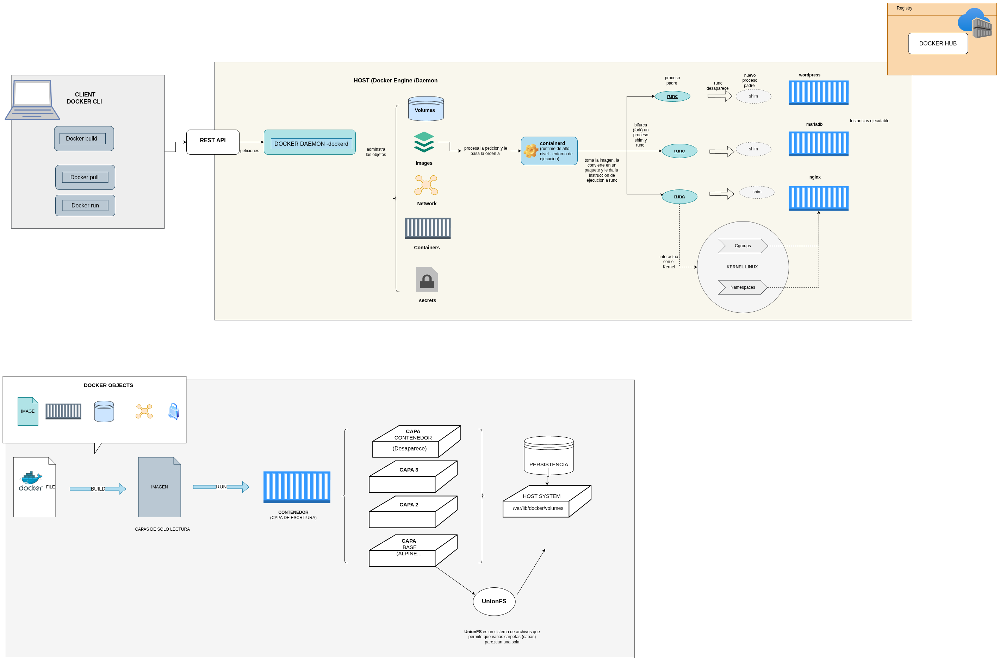
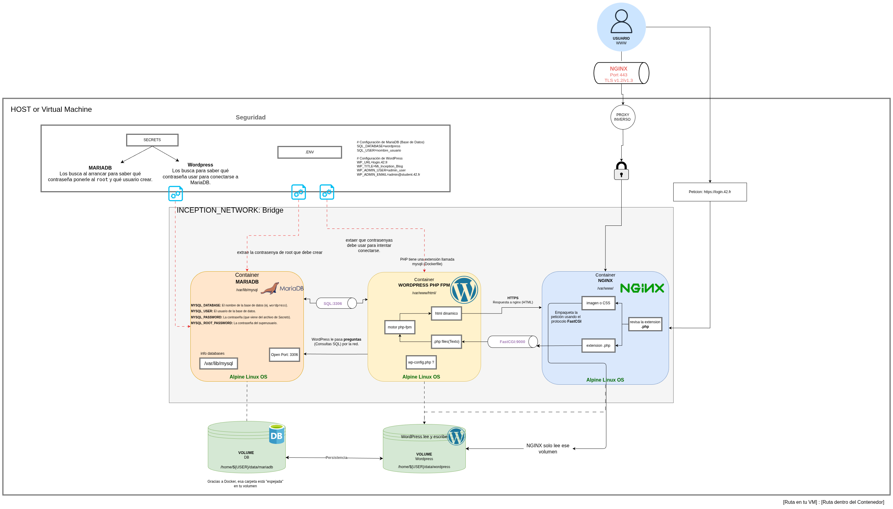

*This project has been created as part of the 42 curriculum by anamedin.*

# 🛠️ DEV_DOC - Developer Documentation

Technical guide for developers to maintain, build, and manage the Inception infrastructure.

## 1. Environment Setup
### Prerequisites
- Operating System: Linux (Debian/Alpine preferred).
- Tools: `make`, `docker`, `docker-compose`, `openssl`.

### Configuration Files and Secrets
- **Environment Variables**: The `./srcs/.env` file is generated by the `Makefile`.
- **Secrets**: Sensitive passwords are generated as `.txt` files in `./srcs/secrets/` using `openssl rand`.
- **Dockerfiles**: Each service has its own recipe in `./srcs/requirements/[service]/Dockerfile`, all based on Alpine 3.22.

### 🐳 Docker Engine & Layers
How Docker manages objects, layers, and the Linux kernel (Namespaces & Cgroups) to provide isolation.

## 2. Build and Launch
The project uses a **Makefile** to orchestrate the build process:
- **Build**: `make build` creates the custom Docker images for each service.
- **Launch**: `make all` (or just `make`) triggers the setup, builds the images, and starts the containers.

### 🚀 Infrastructure Overview
General view of the modular architecture and service connections.

## 3. Management Commands
- **View Logs**: `make logs` or `docker compose logs -f`.
- **Shell Access**: `docker exec -it [container_name] sh`.
- **Rebuild Everything**: `make re` will perform a full cleanup and restart.

## 4. Data Storage and Persistence
### Where is data stored?
- **Database**: `/home/${USER}/data/mariadb`
- **WordPress Files**: `/home/${USER}/data/wordpress`
- **Redis Cache**: `/home/${USER}/data/redis`

### 🔒 Network & Security Flow
Detailed communication between services, volumes, and secrets within the isolated network.

### 📁 Bonus Architecture (FTP Integration)
Architecture overview including the FTP bonus service and the complete modular setup.

---
*This project was developed with the assistance of AI for technical explanations and documentation structuring.*
