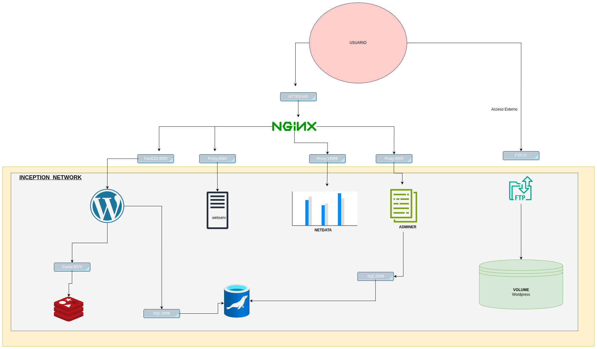

*This project has been created as part of the 42 curriculum by anamedin.*

# Inception



## Description
Inception is a System Administration project designed to broaden knowledge of virtualization using Docker. The goal is to set up a small infrastructure composed of several services, each running in its own dedicated container, managed by Docker Compose. This project emphasizes Infrastructure as Code (IaC), security, and service orchestration.

## Project Description
This project uses **Docker** to containerize each service, ensuring environment consistency and isolation. The **sources included** in this project consist of:
- **srcs/docker-compose.yml**: The main orchestrator that defines services, networks, and volumes.
- **srcs/requirements/**: Custom Dockerfiles and configuration scripts for Nginx, MariaDB, WordPress, and bonus services.
- **srcs/.env**: Environment configuration file (generated automatically by the Makefile).
- **srcs/secrets/**: Secure directory for sensitive credentials (generated automatically).

### Technical Choices & Comparisons
- **Virtual Machines vs Docker**: Virtual Machines include a full guest OS and virtualized hardware, making them resource-heavy. Docker containers share the host's OS kernel, making them lightweight, fast, and efficient.
- **Secrets vs Environment Variables**: Environment variables are visible via `docker inspect`. Docker Secrets (used in this project) are mounted as files in memory (`/run/secrets/`), providing a much higher level of security for sensitive data.
- **Docker Network vs Host Network**: Host network shares the host's IP directly, offering no isolation. Docker Bridge Network (used here) creates an isolated private network for containers, exposing only necessary ports through the Proxy.
- **Docker Volumes vs Bind Mounts**: Bind mounts are tied to a specific path on the host. Docker Volumes are managed by Docker and offer better portability and isolation, although in this project we use bind mounts mapped to `/home/login/data` for easier evaluation.

## Instructions
### Prerequisites
- Docker and Docker Compose installed.
- A Linux-based environment (Debian or Alpine recommended).

### Installation & Execution
1. Clone the repository to your local machine.
2. Run the following command at the root of the project:
   ```bash
   make
   ```
   This command will automatically create data directories, generate secure secrets, build custom images, and start all containers.
3. Add `127.0.0.1 anamedin.42.fr` to your `/etc/hosts` file to access the domain.

## Resources
- [Docker Documentation](https://docs.docker.com/)
- [Nginx TLS Configuration Guide](https://nginx.org/en/docs/http/configuring_https_servers.html)
- [MariaDB Knowledge Base](https://mariadb.com/kb/en/)

### AI Usage
*This project was developed with the assistance of AI for documentation structuring, translation, and technical explanations.*
